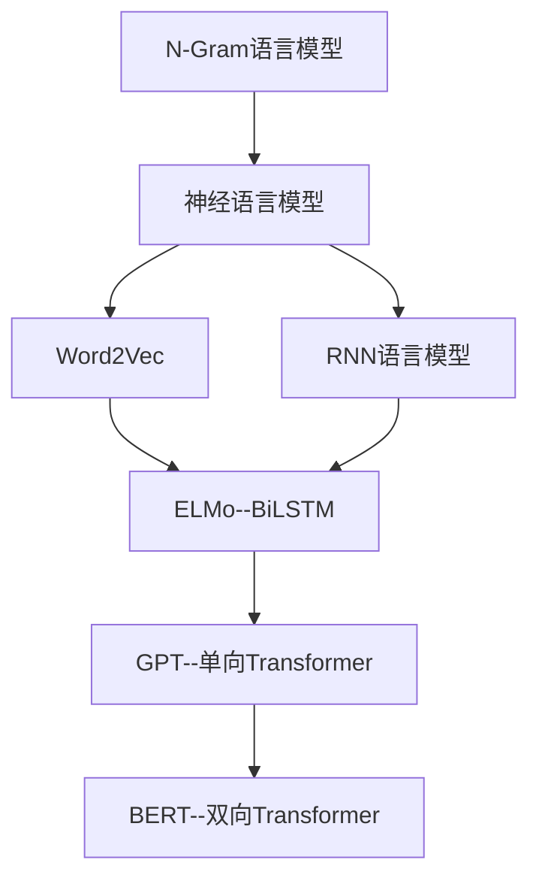

### **机器学习项目实践**

#### **一、基于情感词典的文本分类（sentiment_dict）**

1、DataSet

BosonNLP_sentiment_score.txt——基于中文语义的情感得分（https://bosonnlp.com/）

| 情感词   | 得分           |
| -------- | -------------- |
| 饥寒交加 | -4.51366899338 |
| 落英缤纷 | 2.46142968528  |

degree.txt——程度副词得分

| 程度副词 | 得分 |
| -------- | ---- |
| 超级     | 5    |
| 进一步   | 2    |

notDic.txt——否定词列表

stopwords.txt——停止词列表

2、**sentiment_dict.py**——基于情感词典的文本分类

​	1）`seg_word(sentence)` #文本预处理，分词并去掉停用词

​	2）`classify_words(word_list)`  #对分词结果进行分类：情感词、否定词、程度副词

​	3）`score_sentiment(sen_word, not_word, degreen_word, seg_result)` #计算情感得分

​			
$$
score = ∑W*sen\_word\_score , W=\begin{cases} degree[i]，程度副词 \\ -1，\quad\quad\quad 否定词 \\1, \quad\quad\quad其他情感词 \end{cases}
$$

​	4）`sentiment_score(sentence)` #调度主函数 

​			<!--输入：文本 输出：情感得分-->

#### **二、基于机器学习的垃圾邮件分类（classification）**

1、DataSet

stop_words.utf8——停止词列表

spam_data.txt——垃圾邮件

ham_data.txt——非垃圾邮件

2、normalization.py——数据预处理（标准化）

​	1）`tokenize_text(text)` #文本分词

​	2）`remove_special_characters(text)` #去除特殊符号

​	3）`remove_stopwords(text)` #去除停止词

​	4）`normalize_corpus(corpus, tokenize=False)` #调度主函数

3、feature_extractors.py——文本特征向量化

​	1）`bow_extractor(corpus, ngram_range=(1, 1))` #词袋特征

```python
from sklearn.feature_extraction.text import CountVectorizer

vectorizer = CountVectorizer(min_df=1, ngram_range=ngram_range)

features = vectorizer.fit_transform(corpus)
```

​	texts=["orange banana apple grape","banana apple apple","grape", 'orange apple']

​	{ 'apple': 0,'banana': 1, 'grape': 2,'orange': 3}

​	[[1 1 1 1]     # 第一个字符串（apple，banana，grape，orange）出现的频率为1,1,1,1
​     [2 1 0 0]     # 第二个字符串（apple，banana，grape，orange）出现的频率为2,1,0,0
​     [0 0 1 0]     \# 第三个字符串（apple，banana，grape，orange）出现的频率为0,0,1,0
​     [1 0 0 1]]    \# 第四个字符串（apple，banana，grape，orange）出现的频率为1,0,0,1

​	2）`tfidf_transformer(bow_matrix)` #统计vectorizer中每个词语的TF-IDF值

```python
from sklearn.feature_extraction.text import TfidfTransformer

transformer = TfidfTransformer(norm='l2',smooth_idf=True,use_idf=True)

tfidf_matrix = transformer.fit_transform(bow_matrix)
```

[[0.42344193 0.52303503 0.52303503 0.52303503]
 [0.8508161   0.52546357  0.                  0.                  ]
 [0.                   0.                   1.                  0.                  ]
 [0.62922751 0.                    0.                  0.77722116]]

​	3）`tfidf_extractor(corpus, ngram_range=(1, 1))` #TF-IDF特征

```python
from sklearn.feature_extraction.text import TfidfVectorizer

vectorizer = TfidfVectorizer(norm='l2',smooth_idf=True,use_idf=True)

features = vectorizer.fit_transform(corpus)
```

[[0.42344193 0.52303503 0.52303503 0.52303503]
 [0.8508161   0.52546357  0.                  0.                  ]
 [0.                   0.                   1.                  0.                  ]
 [0.62922751 0.                    0.                  0.77722116]]

4、**classifier.py**——垃圾邮件分类

​	1）`get_data()` #读取数据

​	2）`prepare_datasets(corpus, labels, test_data_proportion=0.3)` #数据预处理

```python
from sklearn.model_selection import train_test_split

'''
  :param corpus: 文本数据

  :param labels: label数据

  :param test_data_proportion:测试数据占比

  :return: 训练数据,测试数据，训练label,测试label

'''

  train_X, test_X, train_Y, test_Y = train_test_split(corpus, labels,

                            test_size=test_data_proportion, random_state=42)
```

​	3）`remove_empty_docs(corpus, labels)` #数据集缺失值处理

​	4）`get_metrics(true_labels, predicted_labels)` #评价指标

```python
from sklearn import metrics

print('准确率:', np.round(metrics.accuracy_score(true_labels,predicted_labels),2))

print('精确率:',
np.round(metrics.precision_score(true_labels,predicted_labels,average='weighted'),2))

print('召回率:', np.round(metrics.recall_score(true_labels,predicted_labels,average='weighted'),2))

print('F1得分:', np.round(metrics.f1_score(true_labels,predicted_labels,average='weighted'),2))
```

|                                 | **相关（Relevant），正类**              | **无关（NonRelevant），负类**           |
| ------------------------------- | --------------------------------------- | --------------------------------------- |
| **被检索到（Retrieved）**       | True Positives（TP，正类判定为正类。）  | False Positives（FP，负类判定为正类。） |
| **未被检索到（Not Retrieved）** | False Negatives（FN，正类判定为负类。） | True Negatives（TN，负类判定为负类。）  |

**准确率（Accuracy）**：就是所有的预测正确（正类负类）的占总的比重。
$$
Accuracy = \frac{TP+TN}{TP+TN+FP+FN}
$$
**精确率（Precision）**：就是正确预测为正的占全部预测为正的比例。
$$
Precision = \frac{TP}{TP+FP}
$$
**召回率（Recall）**：就是正确预测为正的占全部实际为正的比例。
$$
Recall = \frac{TP}{TP+FN}
$$
**F1值（F1 Score）**：均衡精确率和召回率的指标。
$$
F_1 = \frac{2PR}{P+R}=\frac{2TP}{2TP+FP+FN}
$$
​	5）`train_predict_evaluate_model(classifier,train_features, train_labels,test_features, test_labels)` #训练、预测、评估模型

```python
# build model

classifier.fit(train_features, train_labels)

# predict using model

predictions = classifier.predict(test_features)

# evaluate model prediction performance

get_metrics(true_labels=test_labels, predicted_labels=predictions)
```

​	6）**classifier**——各种分类器的使用

```python
from sklearn.naive_bayes import MultinomialNB

from sklearn.linear_model import SGDClassifier

from sklearn.linear_model import LogisticRegression


mnb = MultinomialNB()

svm = SGDClassifier(loss='hinge', n_iter=100) #线性svm、迭代次数

lr = LogisticRegression()
```

| 分类回归器                   | 导入命令                                                     | 导入函数命令                                         |
| ---------------------------- | ------------------------------------------------------------ | ---------------------------------------------------- |
| Linear Regression            | from sklearn.linear_model import LinearRegressor             | lr = LinearRegressor()                               |
| SGD regression penalty L2    | from sklearn.linear_model import SGDRegressor                | SGDR = SGDRegressor("penalty = l2")                  |
| SGD regression penalty L1    | from sklearn.linear_model import SGDRegressor                | SGDR = SGDRegressor("penalty = l1")                  |
| SVR(rbf kernel)              | from sklearn .svm import SVR（Penalty parameter ：C，Kernel coefficient ：gamma） | SVR = SVR(kernel="rbf")                              |
| SVR(sigmoid kernel)          | from sklearn .svm import SVR（Penalty parameter ：C，Kernel coefficient ：gamma） | SVR = SVR(kernel="sigmoid ")                         |
| SVR(poly kernel)             | from sklearn .svm import SVR（Penalty parameter ：C，Kernel coefficient ：gamma） | SVR = SVR(kernel="poly")                             |
| SVR(linear kernel)           | from sklearn .svm import SVR（Penalty parameter ：C，Kernel coefficient ：gamma） | SVR = SVR(kernel="linear")                           |
| Naive Bayes                  | from sklearn.naive_bayes import MultinomialNB                | mnb = MNB_Classifier()                               |
| KNN（n=5，weights=uniform）  | from sklearn.neighbors import KNeighborsRegressor            | knn = KNeighborsRegressor（n=5，weights="uniform"）  |
| KNN（n=5，weights=distance） | from sklearn.neighbors import KNeighborsRegressor            | knn = KNeighborsRegressor（n=5，weights="distance"） |
| DT                           | from sklearn.tree import DecisionTreeRegressor               | DT = DecisionTreeRegressor()                         |
| Random forest                | from sklearn.ensemble import RandomForestRegressor           | RF = RandomForestRegressor()                         |
| Gradient Boosting            | from sklearn.ensemble import GradientBoostingRegressor       | GB = GradientBoostingRegressor()                     |

**各类分类器的比较：**

logistic regression

缺点：从线性回归衍生而来，将线性的值域通过sigmoid函数压缩在（0,1）范围内，要求数据是无缺失的

优点：有两种方式求解，精确的解析解和SGD算法估计，在要求准确性时使用解析解，在要求时间效率时使用SGD 迭代

SVM

缺点：计算代价比较大，SVM是将低维无序杂乱的数据通过核函数（RBF,poly，linear，sigmoid）映射到高维空间，通过超平面将其分开

优点：SVM是通过支持向量做分类的，也就是说不需要计算所有的样本，高维数据中只需去少量的样本，节省了内存，在sklearn默认配置中三种核函数的准确率大概是：RBF>poly>linear

Naive Bayes

缺点：这一模型适合用在文本样本上，采用了朴素贝叶斯原理假设样本间是相互独立的，因此在关联比较强的样本上效果很差

优点：也是基于其独立的假设，概率计算大大简化，节省内存和时间

KNN

缺点：k需要人为设定，且该算法的复杂度很高

优点：“近朱者赤，近墨者黑”KNN是无参数训练的模型

决策树（DT）

缺点：在训练数据上比较耗时

优点：对数据要求度最低的模型，数据可以缺失，可以是非线性的，可以是不同的类型，最接近人类逻辑思维的模型，可解释性好

集成模型

random forest：随机抽取样本形成多个分类器，通过vote，少数服从多数的方式决定最终属于多数的分类器结果，分类器之间是相互去之间关联的

gradient boost：弱分类器按照一定的计算方式组合形成强的分类器，分类器之间存在关联，最终分类是多个分类器组合的结果，最典型的代表是adaboost

一般地，GB>RF>DT

但是集成模型缺点在于受概率的影响，具有不确定性

​	在知道各种分类器的优缺点之后就可以使用正确的分类器完成自己的数据处理，在sklearn默认参数的前提下，准确率排序是：集成模型>DT>SVM>KNN>LR

#### **三、基于朴素贝叶斯的情感分类（douban_sentiment_analysis）**

1、DataSet

stopwords.txt——停止词列表

userdict.txt——用户自定义词表

review.csv——评论情感列表

| 情感倾向 | 评论                                      |
| -------- | ----------------------------------------- |
| 1        | 超级喜欢超级喜欢,不看的话人生不圆满.      |
| 0        | 有点好奇这部片为何被过度赞誉到这个地步··· |

2、native_bayes_sentiment_analyzer.py——主模型

​	1）`__init__(self, model_path, userdict_path, stopword_path)` #参数初始化

​	2）`initialize(self)` #加载模型

​	3）`replace_text(self, text)` #过滤文本中无关字符

​	4）`predict_score(self, text_corpus)` #情感分析计算

​	5）`__cut_word(self, sentence)` #分词

​	6）`analyze(self, text)`  #分类结果展示

3、native_bayes_train.py——模型训练

​	1）`load_corpus(corpus_path)` #加载数据集&预处理

​	2）`load_stopwords(file_path)` #加载停止词

​	3）`review_to_text(review)` #去掉停用词

```python
from sklearn.naive_bayes import MultinomialNB

# 先转换成词频矩阵，再计算TFIDF值

tfidf = tfidftransformer.fit_transform(vectorizer.fit_transform(review_train))

# 朴素贝叶斯中的多项式分类器

clf = MultinomialNB().fit(tfidf, sentiment_train)
```

4、native_bayes_test.py——模型测试

5、**run_test**——测试调度主文件

```python
analyzer = SentimentAnalyzer(model_path=model_path, stopword_path=stopword_path, userdict_path=userdict_path)

text = '倍感失望的一部诺兰的电影，感觉更像是盗梦帮的一场大杂烩。虽然看之前就知道肯定是一部无法超越前传2的蝙蝠侠，但真心没想到能差到这个地步。节奏的把控的失误和角色的定位模糊绝对是整部影片的硬伤。'

analyzer.analyze(text=text)
```

​	<!--输入：文本 输出：情感概率-->

#### **四、基于K-Means的聚类（cluster）**

1、DataSet

stop_words.utf8——停止词列表

data.csv——豆瓣读书列表

| title      | tag                | info                                                         | comments       | content                                                      |
| ---------- | ------------------ | ------------------------------------------------------------ | -------------- | ------------------------------------------------------------ |
| 解忧杂货店 | 豆瓣图书标签: 小说 | [日] 东野圭吾 / 李盈春 / 南海出版公司 / 2014-5 / 39.50元     | (225675人评价) | "现代人内心流失的东西，这家杂货店能帮你找回——僻静的街道旁有一家杂货店，只要写下烦恼投进卷帘门的投信口，第二天就会在店后的牛奶箱里得到回答。因男友身患绝..." |
| 巨人的陨落 | 豆瓣图书标签: 小说 | [英] 肯·福莱特 / 于大卫 / 江苏凤凰文艺出版社 / 2016-5-1 / 129.80元 | (22536人评价)  | “在第一次世界大战的硝烟中，每一个迈向死亡的生命都在热烈地生长——威尔士的矿工少年、刚失恋的美国法律系大学生、穷困潦倒的俄国兄弟、富有英俊的英格兰伯爵，以及痴...” |

2、normalization.py——数据标准化

​	1）`tokenize_text(text)` #分词

​	2）`remove_special_characters(text)` #去除特殊字符

​	3）`remove_stopwords(text)` #去除停止词

​	4）`normalize_corpus(corpus)` #数据标准化输入

3、douban_spider.py——爬取豆瓣网站的书籍信息

4、**cluster.py**——聚类主调度方法

​	1）`build_feature_matrix` #构建特征矩阵

​	2）`k_means(feature_matrix, num_clusters=10)` #k-Means聚类

```python
from sklearn.cluster import KMeans

km = KMeans(n_clusters=num_clusters,max_iter=10000)

km.fit(feature_matrix)

# 给聚集类别打标签
clusters = km.labels_

# 获取cluster的center
ordered_centroids = clustering_obj.cluster_centers_.argsort()[:, ::-1]
```

​	3）`get_cluster_data(clustering_obj, book_data,feature_names, num_clusters,topn_features=10)` #获取每个cluster中的内容

​	4）`print_cluster_data(cluster_data)` #打印各个cluster的内容

**k值选取**

​	手肘法：随着聚类数k的增大，样本划分会更加精细，每个簇的聚合程度会逐渐提高，那么误差平方和SSE自然会逐渐变小。并且，当k小于真实聚类数时，由于k的增大会大幅增加每个簇的聚合程度，故SSE的下降幅度会很大，而当k到达真实聚类数时，再增加k所得到的聚合程度回报会迅速变小，所以SSE的下降幅度会骤减，然后随着k值的继续增大而趋于平缓。
$$
SSE=\sum_{i=1}^k\sum_{p∈C_i}|p-m_i|^2
$$
Ci是第i个簇，p是Ci中的样本点，mi是Ci的质心（Ci中所有样本的均值），SSE是所有样本的聚类误差，代表了聚类效果的好坏。

#### **五、基于FastText的文本分类**

1、DataSet

cnews.test.txt——新闻数据集

| 类别 | 新闻                                                         |
| ---- | ------------------------------------------------------------ |
| 体育 | 黄蜂vs湖人首发：科比冲击七连胜 火箭两旧将登场新浪体育讯北京时间3月28日，NBA常规赛洛杉矶湖人主场迎战新奥尔良黄蜂，赛前双方也公布了首发阵容：点击进入新浪体育视频直播室点击进入新浪体育图文直播室点击进入新浪体育NBA专题点击进入新浪NBA官方微博双方首发阵容：湖人队：德里克-费舍尔、科比-布莱恩特、罗恩-阿泰斯特、保罗-加索尔、安德鲁-拜纳姆黄蜂队：克里斯-保罗、马科-贝里内利、特雷沃-阿里扎、卡尔-兰德里、埃梅卡-奥卡福(新浪体育) |
| 时尚 | 组图：中秋节见公婆 讨喜好媳妇装出来导语：中秋时节，很多女生都会去男朋友家里拜访家长，这时候，如果穿得太随便的话，会给长辈一个不好的印象。气质型的淑女装是最让长辈喜欢的一种装扮。尤其在初秋时节，西装、衬衫都能营造出好媳妇的印象。 |

2、config.py——参数配置

3、data_helper.py——数据预处理

​	1）`process_data(config)` #加载数据并预处理

​	2）`generate_vocab(X, y, config)` #根据数据集构建词表

​	3）`padding(X, y, config, word_to_index, label_to_index)` #文本向量化

​	4）`split_data(input_x, input_y, config)` #将数据集划分成训练、测试、验证集

​	5）`generate_batchs(x_train, y_train, config, shuffle=True)` #数据集随机分批

​	6）`load_json(json_file_path)` #加载词表

4、fast_text.py——主模型


​	和CBOW一样，fastText模型也只有三层：输入层、隐含层、输出层（Hierarchical Softmax），输入都是多个经向量表示的单词，输出都是一个特定的target，隐含层都是对多个词向量的叠加平均。不同的是，CBOW的输入是目标单词的上下文，fastText的输入是多个单词及其n-gram特征，这些特征用来表示单个文档；CBOW的输出是目标词汇，fastText的输出是文档对应的类别。

​	核心：**将整篇文档的词及n-gram向量叠加平均得到文档向量，然后使用文档向量做softmax多分类**

5、train.py——训练模型

6、predict.py——预测主调度方法

​	<!--输入：文本 输出：新闻分类-->

#### **六、基于BERT的情感分类**



1、DataSet

train_E6oV3lV.csv——标记tweet数据集

| id   | label | tweet                                                        |
| ---- | ----- | ------------------------------------------------------------ |
| 1    | 0     | @user when a father is dysfunctional and is so selfish he drags his kids into his dysfunction.  #run |
| 35   | 1     | it's unbelievable that in the 21st century we'd need something like this. again. #neverump #xenophobia |

2、**bert_classification.py**——分类调度主文件

```python
from bert_serving.client import BertClient

# make a connection with the BERT server using it's ip address

bc = BertClient()

# get the embedding for train and val sets

X_tr_bert = bc.encode(X_tr.tolist())

X_val_bert = bc.encode(X_val.tolist())
```

#### **七、文本相似度和聊天机器人**

**经典文本相似度匹配方法（sim）**

1、editdistance.py——基于编辑距离的文本相似度匹配

删除一个字符/插入一个字符/替换一个字符需要几步变换

2、Jaccard.py——基于Jaccard相似性的文本相似度匹配

Jaccard*(A,B) =* |*A* ∩ *B*| / |*A* ∪ *B*|

3、cos.py——基于余弦相似度的文本相似度匹配


4、hashsim.py——基于汉明距离的文本相似度匹配

两个字符串相互转化所需替换的字符数

5、tfidf.py——基于TF-IDF的文本相似度匹配

**基于深度学习的文本相似度匹配方法（text_matching）**

1、DataSet

train.csv  test.csv  dev.csv——训练集  测试集  验证集

| sentence1              | sentence2                  | label |
| ---------------------- | -------------------------- | ----- |
| 借款后多长时间给打电话 | 借款后多久打电话啊         | 1     |
| 0K，谢谢，还没有开通   | 开通为什么显示证件已被使用 | 0     |

2、args.py——参数设置

3、graph.py——主模型

4、train.py——训练

5、test.py——测试


**开源文本相似度匹配方法（matchzoo-experiments）**

DataSet

toy_matchzoo_test.csv  toy_matchzoo_train.csv——测试集  训练集

| id_left | text_left       | id_right | text_right                                                   | label |
| ------- | --------------- | -------- | ------------------------------------------------------------ | ----- |
| Q1798   | what are k cups | D1700-3  | "K-Cup portion packs are used with Keurig or other single cup brewing systems to brew a cup of coffee , tea , or hot chocolate ." | 1     |
| Q1798   | what are k cups | D706-1   | "Demographers, historians and commentators use beginning birth dates from the early 1960s to the early 1980s ." | 0     |

**基于检索的聊天机器人（xiaotian-chatbot1.0）**

**基于生成的聊天机器人（chatbot-rnn）**

#### 八、总结

**1、数据收集**

**2、数据预处理与特征工程**

数据清理：缺失值处理、离群点处理、噪声处理

数据集成：数据集的冲突和处理

数据规约：维度规约（filter、wrapper、embedded）、维度变换（PCA、LDA）

数据变换：规范化、离散化、连续化

**3、模型的选择与训练**

监督学习：经典算法（线性回归、逻辑回归、决策树、支持向量机、KNN）、概率图模型（朴素贝叶斯、最大熵模型、隐马尔可夫模型、条件随机场）

非监督学习：聚类（KMeans、GMM）、主题模型

集成学习：Bagging（随机森林）、Boosting（Adaboost、GBDT、XGBoost）、Stacking

强化学习、深度学习、迁移学习

**4、模型的评估与优化**

评价指标（精确率、召回率、准确率、F1、AUC、ROC）、A/B测试、过拟合与欠拟合

验证方法：Holdout（7-3）检验、k-fold交叉检验、bootstrap检验（样本小）

损失函数（选取）优化：最小二乘法、梯度下降法（随机、批量、Momentum、AdaGrad、Adam）、牛顿法、拟牛顿法

采样：不均衡样本重采样、拒绝采样重要性采样（低维）、MCMC采样（Metropolis-Hastings采样、吉布斯采样）（高维）